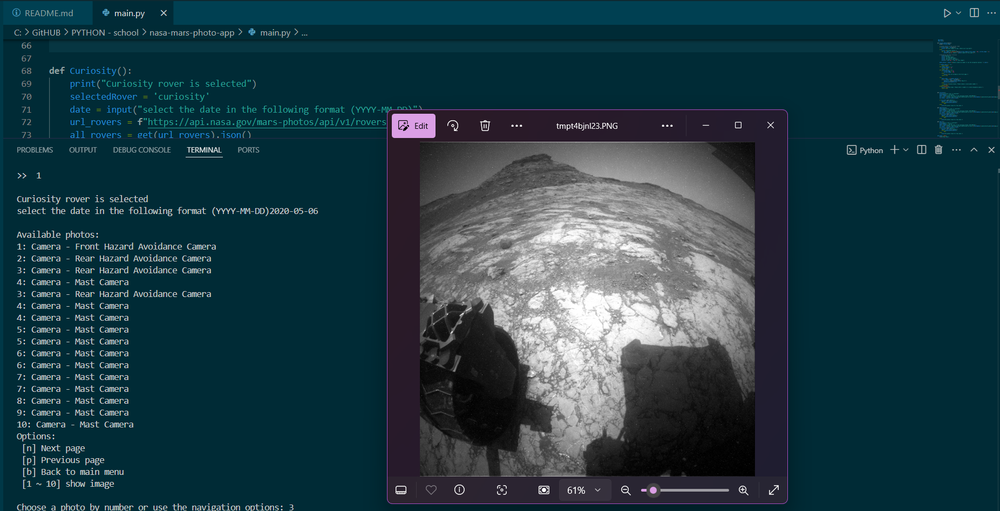

# Mars Rover Photo Viewer

## Description

The Mars Rover Photo Viewer allows users to explore photos taken by NASA's Mars rovers (Curiosity, Opportunity, and Spirit). Users can view images by selecting a specific rover and date, navigating through the available photos using a simple menu system.

## Usage

1. **Run the program** using Python.
2. **Select a Mars rover** (Curiosity, Opportunity, or Spirit) from the main menu.
3. **Enter the desired Earth date** in the format `YYYY-MM-DD`.
4. **Browse through available photos** using the navigation options:
   - `[n]` for the next page
   - `[p]` for the previous page
   - `[b]` to return to the main menu
5. **Enter the photo number** to view the selected image.

## Features

- Fetch photos from NASA's Mars rover API.
- Browse images taken by different rovers on specific dates.
- Simple navigation with options to view images or return to the main menu.

## Screenshots

## API Information

This project utilizes the NASA Mars Rover Photos API to fetch images captured by rovers. The API key used is specified in the program.

## Libraries Used

- **requests**: For sending HTTP requests to the NASA API.
- **Pillow**: For handling and displaying images.
- **menu**: For managing the interactive menu system.
